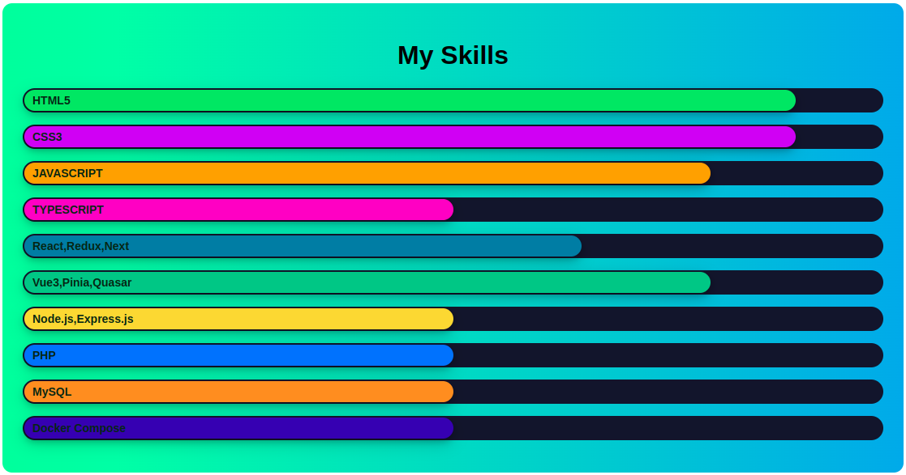

### Hi there 👋  I am a frontend developer with over 3 years of experience.

### Projects:

<table>
 <tr>
    <th align="center">
<small>Commercial</small>
</th>
    <th align="center">
<small>Pet projects</small>
</th>
 </tr>

<tr>
<td>

+ [good fairy](https://xn----7sbbbx0a1amepifh.xn--p1ai/), [git](https://github.com/SergoDrovski/good-fayri_test/tree/1.1), (
  Next, React, Strapi, GraphQL)
+ [korona rest](https://koronatuapse.ru/), [git](https://github.com/SergoDrovski/sait_korona/tree/docker-v1), (Next,
  React, Strapi, GraphQL)
+ [game vitrine](https://mmm.games/?template=vue), (Vite, Vue3, Pinia, vue-router)

</td>
<td>

+ [Game Lotto](https://sergodrovski.github.io/widget-loto/), [git](https://github.com/SergoDrovski/widget-loto/tree/dev), (
  Vite, React, Redux, reduxjs/toolkit)

</td>
</tr>
</table>

